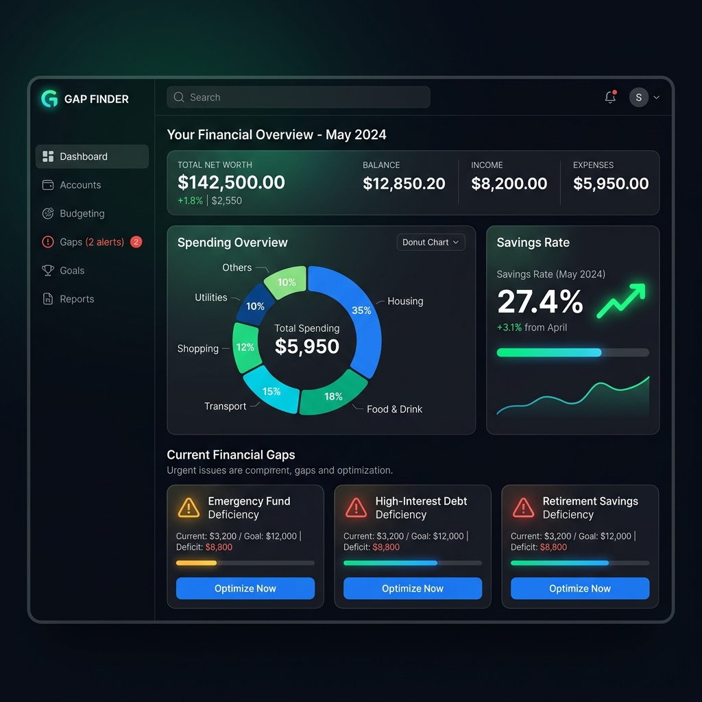
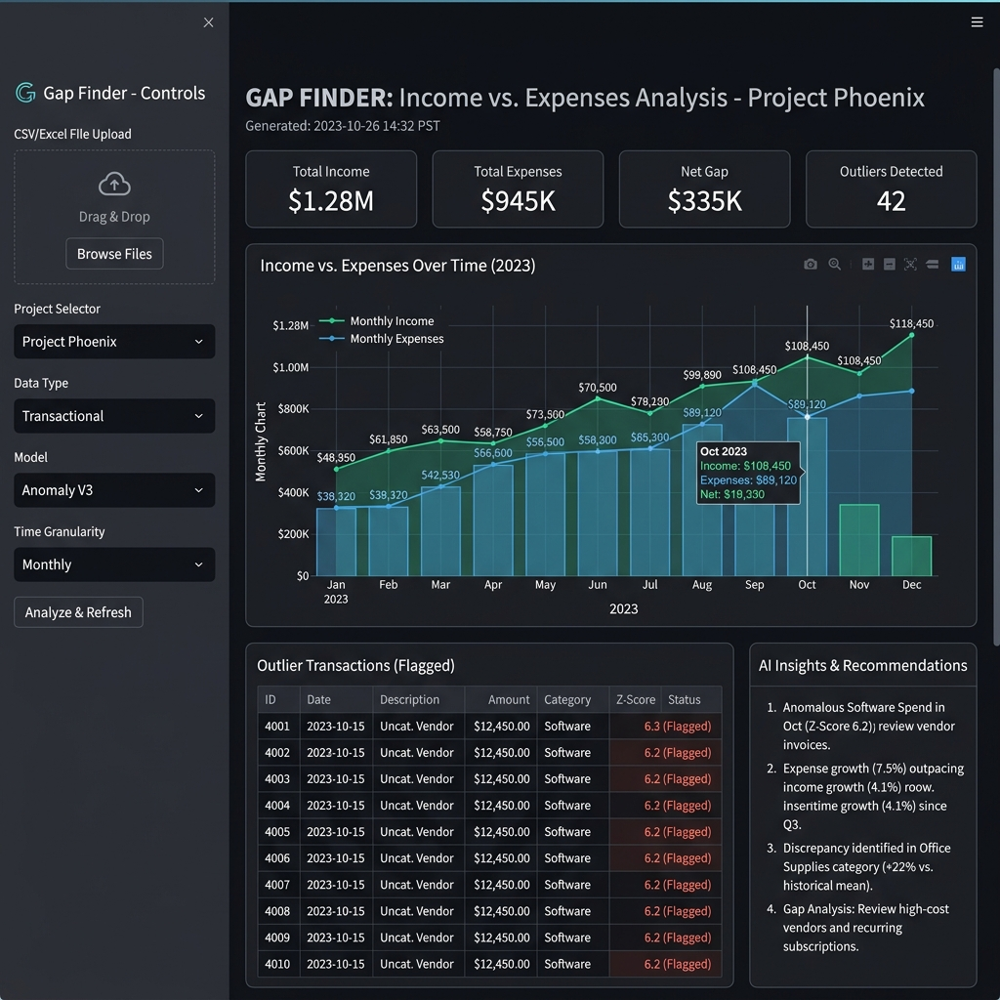

# 💸 Personal Finance Gap Finder

[](https://nextjs.org/)
[](https://tailwindcss.com/)
[](https://streamlit.io/)
[](https://opensource.org/licenses/MIT)

An elite, multi-interface financial intelligence platform designed to uncover "leaks" in your personal economy. Whether you prefer the **Modern Flagship Dashboard (Next.js)** or the **Original Intelligence Terminal (Streamlit)**, Gap Finder uses advanced heuristics and AI to transform messy bank statements into actionable savings.



---

## 📋 Submission Overview

This project is submitted as a functional prototype for [Event/Competition Name]. It addresses the problem of financial opacity and privacy in personal budgeting.

- **[Project Overview](OVERVIEW.md)**: Detailed breakdown of the problem, solution, and impact.
- **[Presentation Script](PRESENTATION.md)**: A structured pitch for the Gap Finder platform.
- **Prototype**: Fully functional Next.js and Streamlit interfaces (see [Getting Started](#-getting-started)).

---

## 🏗️ The Architecture

Gap Finder is built on a **Privacy-First, Local-First** philosophy. Your financial data stays in your browser (Next.js) or on your local machine (Streamlit).

### 1. Flagship Dashboard (Next.js)
The premium web experience designed for speed, aesthetics, and institutional-grade visualization.
- **Location**: `/frontend`
- **Tech**: Next.js 16.2 (App Router), Tailwind CSS v4, Recharts, PapaParse.
- **AI**: Secure server-side integration with OpenRouter for LLM-driven insights.

### 2. Intelligence Terminal (Streamlit)
The original Python-powered engine for rapid data science and detailed transaction analysis.
- **Location**: `/app`
- **Tech**: Python 3.11+, Streamlit, Pandas, Plotly.
- **AI**: Direct integration with LLM providers for heuristic analysis.

---

## ✨ Key Features

- **🛡️ Secure Client-Side Parsing**: Bank CSVs are parsed instantly using PapaParse (Next.js) or Pandas (Streamlit). No transaction data ever hits our servers.
- **🧠 AI-Powered Gaps**: Advanced heuristics detect spending patterns that exceed 50/30/20 budget benchmarks or customized thresholds.
- **📊 Institutional Visualizations**: High-fidelity charts showing spending distribution, income-to-expense ratios, and top transaction drains.
- **🔮 Savings Simulator**: Interactive tools to project the long-term impact of plugging specific financial leaks.
- **🧹 Auto-Normalization**: Intelligent header mapping that handles "dirty" CSV data from different financial institutions.



---

## 🚀 Getting Started

### Flagship Dashboard (Next.js)

1. **Navigate to the frontend**:
   ```bash
   cd frontend
   ```
2. **Install dependencies**:
   ```bash
   npm install
   ```
3. **Configure Environment**:
   Create a `.env.local` file:
   ```env
   OPENROUTER_API_KEY="your_api_key_here"
   ```
4. **Launch**:
   ```bash
   npm run dev
   ```

### Intelligence Terminal (Streamlit)

1. **Install requirements**:
   ```bash
   pip install -r requirements.txt
   ```
2. **Launch Terminal**:
   ```bash
   streamlit run app/main.py
   ```

---

## 📊 Data Preparation

The system expects a CSV file with at least three columns:
- **Date**: Transaction date.
- **Description**: Merchant or transaction details.
- **Amount**: Negative for expenses, positive for income.

*Sample data is provided in `app/sample_data.csv` for immediate testing.*

---

## 🏆 Development Principles

This project demonstrates the evolution from a Python prototype to a production-ready SaaS interface:
- **Scalable UI**: Tailwind v4 for a cutting-edge design system.
- **Type Safety**: Full TypeScript implementation in the modern dashboard.
- **Modular Logic**: Shared categorization heuristics across both platforms.

---

Designed with 💙 for financial freedom.
